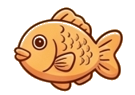

# 🐟 붕어짱 (Boongeojjang) - 프리미엄 붕어빵 주문 쇼핑몰

> **"겉은 바삭, 속은 촉촉! 나만의 프리미엄 붕어빵을 커스텀 주문하고 관리하는 모바일 하이브리드 웹 앱"**
> 본 프로젝트는 먹음직스러운 카라멜 오렌지 앰버와 따뜻한 딥 브라운 테마의 프리미엄 브랜딩이 적용된 싱글 페이지 애플리케이션(SPA) 주문 제작형 쇼핑몰입니다.

---

## 🚀 1. GitHub & Vercel 연동 가이드

본 저장소는 지속적 통합 및 자동 배포를 위해 **GitHub** 및 **Vercel**과 연동되도록 구성되었습니다.

### 🔗 GitHub 리포지토리 정보
* **저장소 주소**: `https://github.com/tintiger-byte/boongeojjang.git`
* **기본 브랜치**: `main`

### ⚡ Vercel 실시간 자동 배포 단계
1. **[Vercel 대시보드](https://vercel.com/dashboard)**에 접속하여 GitHub 계정으로 로그인합니다.
2. **[Add New...]** ➡️ **[Project]**를 클릭합니다.
3. Import Git Repository 목록에서 `boongeojjang`을 찾아 **[Import]**를 클릭합니다.
4. **Build & Development Settings**는 정적 웹 애플리케이션이므로 별도 수정 없이 기본값(Vite/Create React App 등이 없는 Pure HTML/JS/CSS 설정)으로 유지합니다.
5. 최하단의 **[Deploy]** 버튼을 클릭하면 약 30초 안에 전 세계 어디서든 고유 URL을 통해 접속할 수 있는 서비스가 배포됩니다.
6. 이후 GitHub `main` 브랜치에 코드를 `git push`할 때마다 Vercel이 변경 사항을 감지하여 **실시간으로 자동 무중단 업데이트 배포**를 수행합니다.

---

## ✨ 2. 핵심 구현 기능 (Key Features)

### ⚙️ 프리미엄 마이페이지 및 설정 (`#scr-settings`)
* 모든 주요 주문 제작 단계(도우, 속재료, 음료 선택 및 장바구니) 우측 상단에 **톱니바퀴 아이콘(⚙️)**을 통해 설정 창에 바로 진입할 수 있습니다.
* 로그인된 사용자 세션 상태에 따라 **등급 뱃지**(비인증 게스트, 인증 회원, 최고관리자) 및 아바타가 동적으로 변경되어 보여집니다.
* 일반 로그인 시 비밀번호 6자리 유효성 검사 및 편리한 암호 찾기(전화번호 기반 모의 SMS 전송) 기능이 완벽하게 제공됩니다.

### 👑 동적 관리자 모드 및 제어 콘솔 (`#scr-admin-console`)
* **회원 관리**: 가입한 회원 목록을 조회하고, 실시간으로 일반 회원 $\leftrightarrow$ 관리자 권한을 승격/강등하거나 불량 회원을 차단 및 차단 해제 처리합니다.
* **리뷰 관리**: 사용자가 남긴 상품 리뷰를 실시간으로 모니터링하여, 적절치 않은 리뷰를 가리는 블라인드 기능 및 영구 삭제 기능을 지원합니다.
* **실시간 상품 등록**: 관리자가 콘솔에서 신규 도우, 속재료, 음료 메뉴를 등록하면 **실시간으로 사용자의 실물 메뉴판 화면에 해당 스타일 템플릿의 카드가 DOM 주입 방식으로 즉시 추가**되어 주문 목록에 동적 반영됩니다!

### 🔑 비밀 우회 로그인 (Secret Bypass 이스터 에그)
* 인트로 화면 상단의 붕어빵 로고 이미지(`top_fish.png`)를 연속으로 **5번 탭**하면, 로그인 정보 입력 창을 우회하여 즉시 최고관리자 권한(`010-0000-0000`, `최고관리자`)으로 마스터 로그인되어 관리자 전용 콘솔로 다이렉트 진입합니다.

### 📱 Visual Excellence & 쾌적한 UX 개량
* **화면 가장자리 잘림 개선**: 도우 및 속재료 선택 시 원형 카드가 목업 테두리에 잘려 보이지 않는 현상을 최적 햅틱 패딩 조율을 통해 해결했습니다.
* **네이티브 스크롤바 화살표 제거**: 모바일 하이브리드 목업 화면의 자연스러운 스크롤 감각을 위해, PC 브라우저용 불투명하고 작동하지 않는 네이티브 스크롤바와 상/하 화살표(▲, ▼)를 CSS 단독 규칙을 통해 화면에서 완전 제거하여 아름답고 모던한 스와이프를 연출했습니다.

---

## 🛠️ 3. 기술 스택 (Tech Stack)

* **프론트엔드**: Vanilla HTML5, CSS3 Custom Variables, ES6 JavaScript
* **아이콘 & 그래픽**: Material Icons Round, Custom Premium PNG Assets
* **배포 및 인프라**: GitHub, Vercel (CI/CD 자동 빌드 연동)
